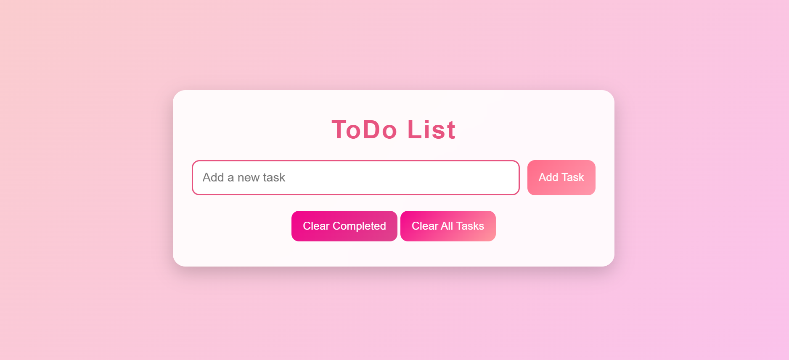

# :memo: To-Do List Web App

A simple and fully responsive **To-Do List** application built using **HTML, CSS, and JavaScript**.  
It allows users to easily manage their daily tasks in an interactive way.

## :rocket: Features
:heavy_plus_sign: **Add new tasks** with ease  
:white_check_mark: **Mark tasks as completed** using checkboxes  
:wastebasket: **Remove completed tasks** with a single click  
:arrows_counterclockwise: **Clear all tasks** at once  
:iphone: **Fully responsive design** – works on desktop, tablet, and mobile  

## 💻 Technologies Used
**HTML5** – Structure of the app  
**CSS3** – Styling & responsive design  
**JavaScript** – Functionality & interactivity  

## 📸 Demo Preview
Here’s how the To-Do List app looks:
